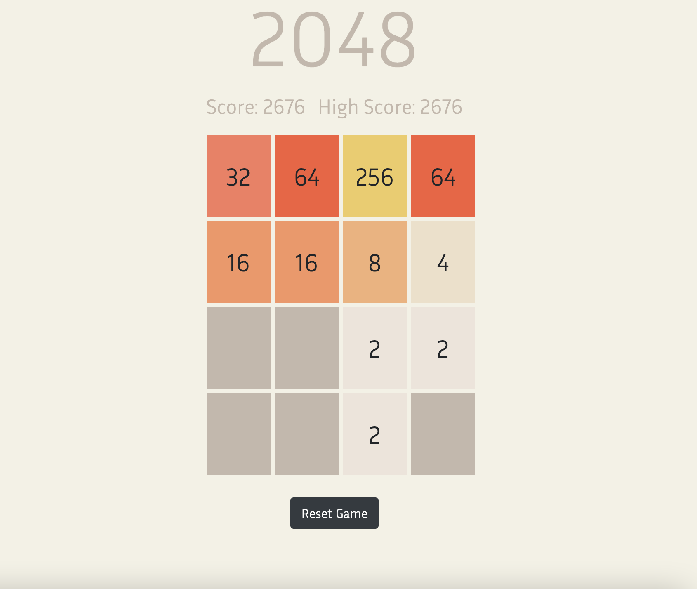
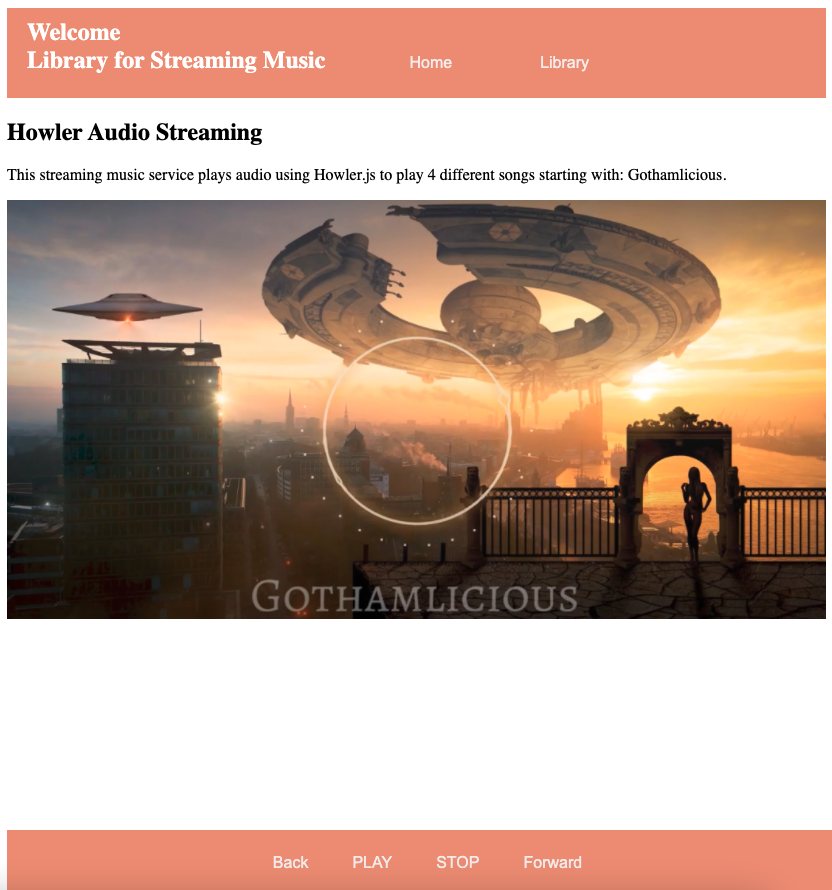
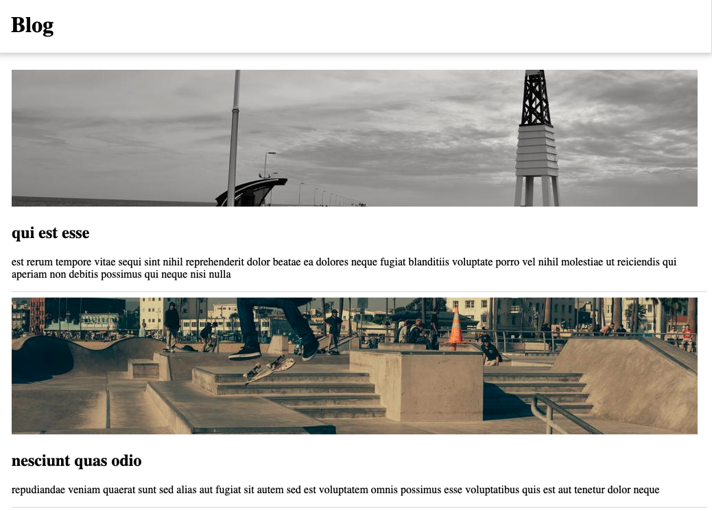
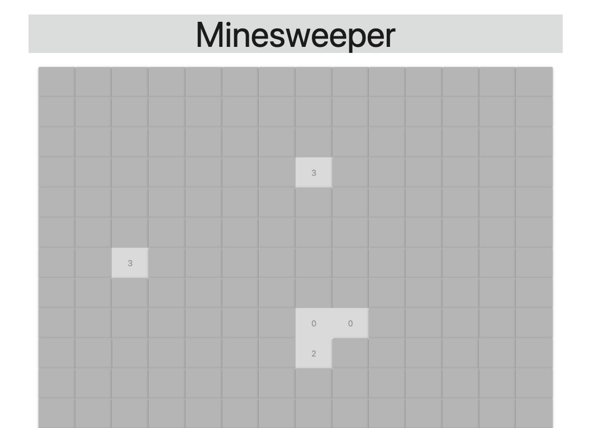
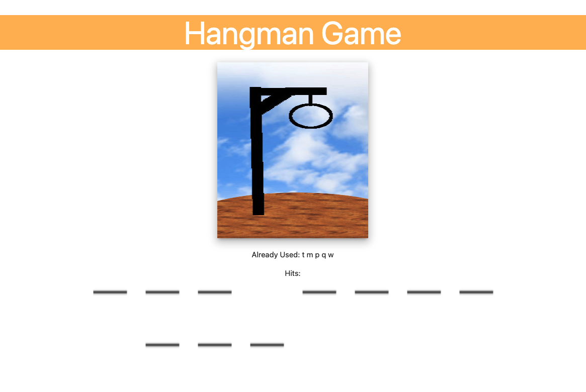

# Netcentric Programming

Created applications using JavaScript, AJAX and JSON/XML for client-server communication and Web Services. Used Dynamic HTML, Cascading Style Sheets, JavaScript and AJAX to develop the client side of Rich Internet and Web Applications with Firebase. Also used frameworks such as Vue, Angular and React.

---

### 2048

### Weather

### Music Streaming

### Blogging

### User Management

### Minesweeper

### Hangman

