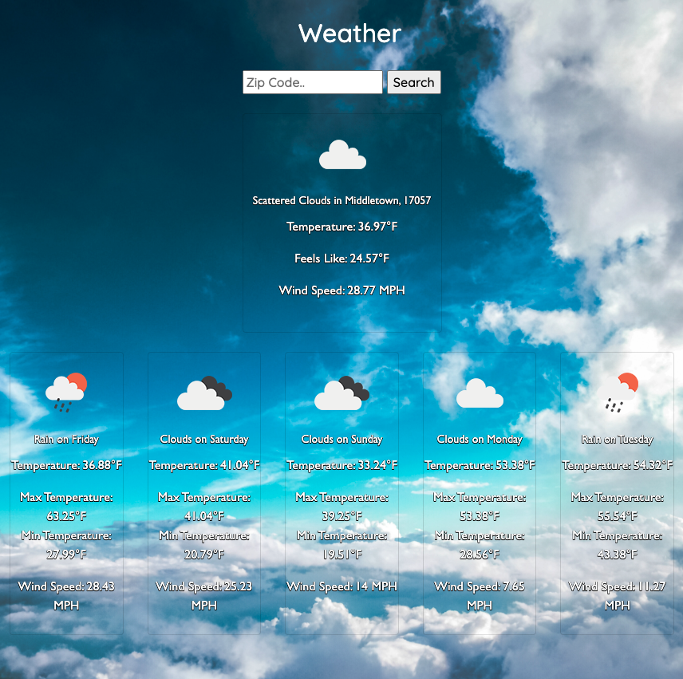

# Weather Application
Retrieved data for the screen from weather.gov API:   https://www.weather.gov/documentation/services-web-api  
Used MapQuests API to convert the Zip Code to latitude and longitude coordinates: https://developer.mapquest.com/documentation/open/geocoding-api/address/get/  

### Weather

